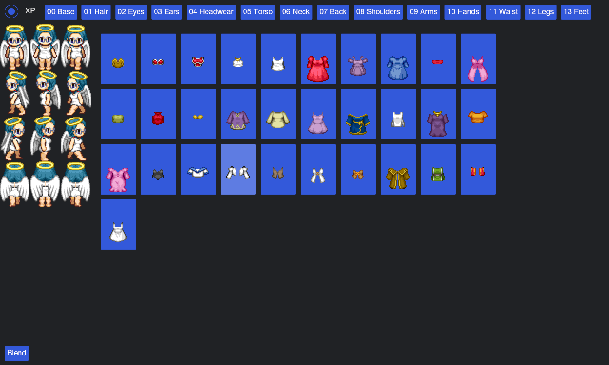

# Liberty Sprite Creator

Liberty Sprite Creator is a flexible tool to create your own characters (like in RPG Maker) using layered images. You have full control over layers, versions of RPG Maker, and folder organization.  

WARNING!!!!!

Project in Alpha unstable release!!!

## Screenshot

### How it Works

1. Each folder inside `src/img` represents a "layer".  
   - Higher numbers mean higher layers (e.g., `00 Base` is below `01 Hair`).  
2. Inside each layer folder, there is a folder for the "version" of the model you are using.  
3. When you run the program, it combines the images layer by layer and saves the result in `src/Result`.  

### Customization

You can completely customize your image folders:

- You can delete everything in `src/img` and create as many folders as you want.  
- Name the folders however you like (any language is fine).  
- !!Important: Keep a consistent numbering prefix for layers (e.g., `01`, `02`, `03`).  
- Inside each layer folder, make sure there is at least one subfolder. The subfolder names should be consistent across all layers.  

### How to build and run?

Just use this:
- Build:
  - `cargo build --release`
- Run:
  - `cargo run`

---

## Getting Started

1. Prepare your image layers in `src/img`.  
2. Make sure each layer has a corresponding version folder.  
3. Run the program and check `src/Result` for your generated character.

## License
GPL-3.0
## Credits
Looseleaf - Mack
